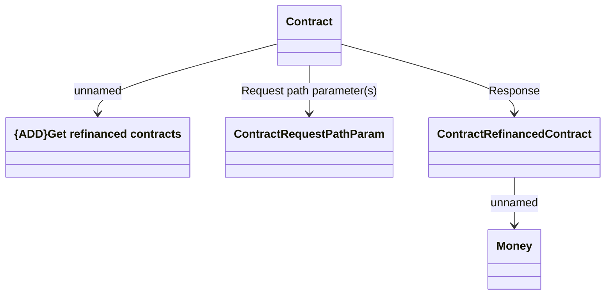

# getRefinancedContracts

```mermaid
classDiagram
    class ADD_Get_refinanced_contracts["{ADD}Get refinanced contracts"]
    class ContractRequestPathParam["ContractRequestPathParam"]
    class Contract["Contract"]
    class Money["Money"]
    class ContractRefinancedContract["ContractRefinancedContract"]
    ContractRefinancedContract --> Money : unnamed
    Contract --> ContractRefinancedContract : Response
    Contract --> ADD_Get_refinanced_contracts : unnamed
    Contract --> ContractRequestPathParam : Request path parameter(s)
```
