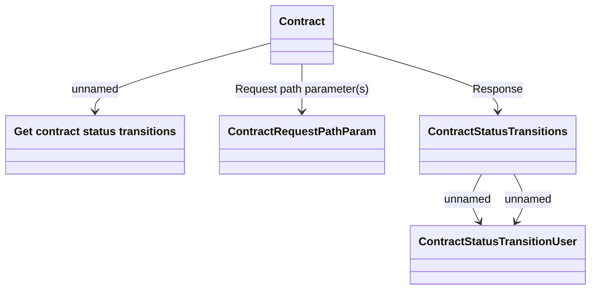

# getStatusTransitions

```mermaid
classDiagram
    class Get_contract_status_transitions["Get contract status transitions"]
    class ContractRequestPathParam["ContractRequestPathParam"]
    class Contract["Contract"]
    class ContractStatusTransitionUser["ContractStatusTransitionUser"]
    class ContractStatusTransitions["ContractStatusTransitions"]
    ContractStatusTransitions --> ContractStatusTransitionUser : unnamed
    ContractStatusTransitions --> ContractStatusTransitionUser : unnamed
    Contract --> ContractStatusTransitions : Response
    Contract --> Get_contract_status_transitions : unnamed
    Contract --> ContractRequestPathParam : Request path parameter(s)
```
