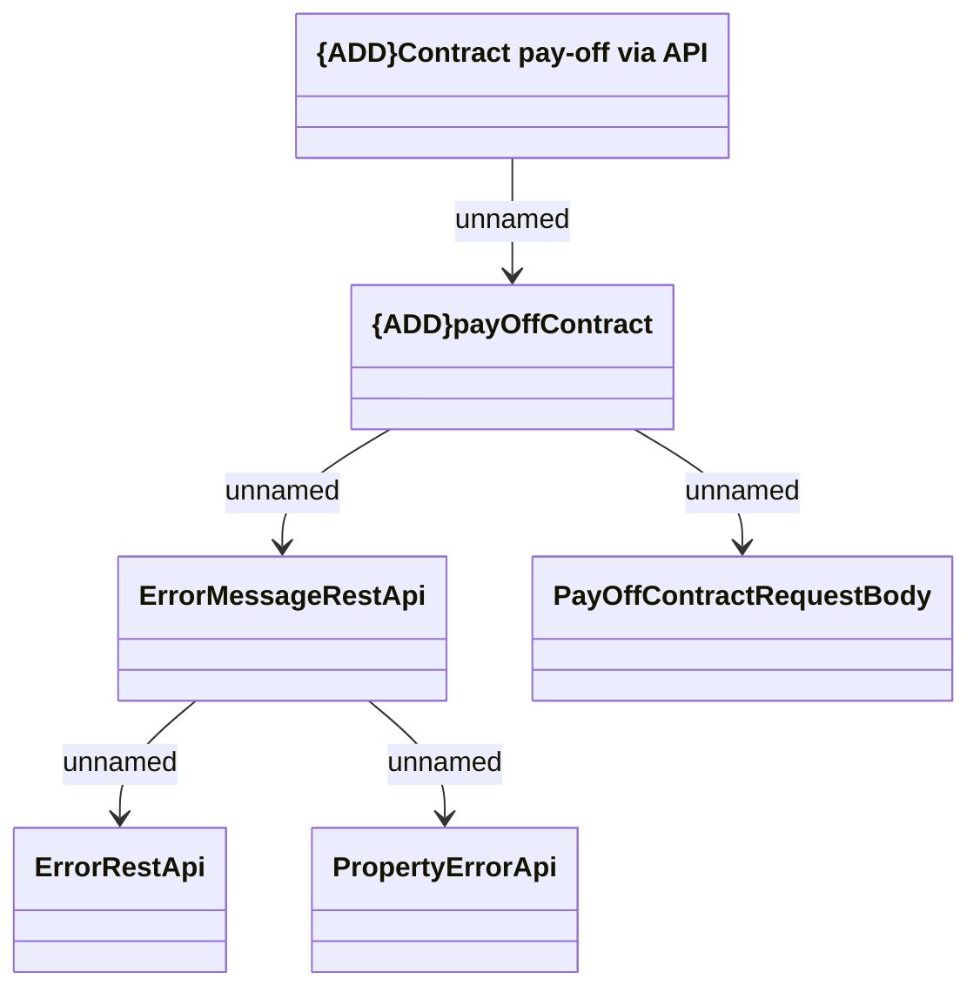

# payOffContract

```mermaid
classDiagram
    class ADD_payOffContract["{ADD}payOffContract"]
    class PropertyErrorApi["PropertyErrorApi"]
    class ErrorRestApi["ErrorRestApi"]
    class ErrorMessageRestApi["ErrorMessageRestApi"]
    class PayOffContractRequestBody["PayOffContractRequestBody"]
    class ADD_Contract_pay_off_via_API["{ADD}Contract pay-off via API"]
    ErrorMessageRestApi --> ErrorRestApi : unnamed
    ADD_payOffContract --> ErrorMessageRestApi : unnamed
    ADD_payOffContract --> PayOffContractRequestBody : unnamed
    ADD_Contract_pay_off_via_API --> ADD_payOffContract : unnamed
    ErrorMessageRestApi --> PropertyErrorApi : unnamed
```
