# searchContracts

- **Diagram Type**: Logical
- **Package**: HomerSelect/BSL/Modules/Contract Management (COMA)/Interface Provided/REST/Application Interface Model/Contracts/v12/searchContracts
- **Diagram ID**: 163926
- **Elements**: 39
- **Connectors**: 57

```mermaid
classDiagram
    class Contract["Contract"]
    class ADD_ServiceDefinition["{ADD}ServiceDefinition"]
    class ADD_ContractApplicant["{ADD}ContractApplicant"]
    class ADD_JOINT_LENDER_DEFAULT["{ADD}JOINT_LENDER_DEFAULT"]
    class ADD_OWNER_DEFAULT["{ADD}OWNER_DEFAULT"]
    class ADD_ContractOwner["{ADD}ContractOwner"]
    class ADD_ContractJointLender["{ADD}ContractJointLender"]
    class ADD_APPLICANT_DEFAULT["{ADD}APPLICANT_DEFAULT"]
    class STATUS_TRANSITION_DEFAULT["STATUS_TRANSITION_DEFAULT"]
    class SERVICE_DEFAULT["SERVICE_DEFAULT"]
    class REFINANCED_CONTRACT_DEFAULT["REFINANCED_CONTRACT_DEFAULT"]
    class PRODUCT_DEFAULT["PRODUCT_DEFAULT"]
    class EXTENDED_PROPERTIES_DEFAULT["EXTENDED_PROPERTIES_DEFAULT"]
    class DOCUMENT_DEFAULT["DOCUMENT_DEFAULT"]
    class DEFAULT["DEFAULT"]
    class CUSTOMER_DEFAULT["CUSTOMER_DEFAULT"]
    class COMMODITY_DEFAULT["COMMODITY_DEFAULT"]
    class BUSINESS_EVENT_FULL["BUSINESS_EVENT_FULL"]
    class BUSINESS_EVENT_DEFAULT["BUSINESS_EVENT_DEFAULT"]
    class ACCOUNT_DEFAULT["ACCOUNT_DEFAULT"]
    class ContractCustomer["ContractCustomer"]
    class ContractStatusTransitionUser["ContractStatusTransitionUser"]
    class ContractStatusTransitions["ContractStatusTransitions"]
    class ContractRefinancedContract["ContractRefinancedContract"]
    class ContractExtendedProperty["ContractExtendedProperty"]
    class ContractBusinessEventUser["ContractBusinessEventUser"]
    class ContractBusinessEventAttribute["ContractBusinessEventAttribute"]
    class ContractBusinessEvent["ContractBusinessEvent"]
    class ContractService["ContractService"]
    class ContractProduct["ContractProduct"]
    class ADD_ContractCommodity["{ADD}ContractCommodity"]
    class ADD_ContractAccount["{ADD}ContractAccount"]
    class Contract["Contract"]
    class MOD_ContractDocument["{MOD}ContractDocument"]
    class MOD_Contracts_search["{MOD}Contracts search"]
    class ContractsRequestQuery["ContractsRequestQuery"]
    class ContractsResponse["ContractsResponse"]
    class ADD_Define_set_of_attributes_for_response["{ADD}Define set of attributes for response"]
    class MOD_Get_documents_for_contract["{MOD}Get documents for contract"]
    Contract ..> DEFAULT : unnamed
    ContractRefinancedContract ..> REFINANCED_CONTRACT_DEFAULT : unnamed
    ContractProduct ..> PRODUCT_DEFAULT : unnamed
    ContractExtendedProperty ..> EXTENDED_PROPERTIES_DEFAULT : unnamed
    MOD_ContractDocument ..> DOCUMENT_DEFAULT : unnamed
    Contract ..> DEFAULT : unnamed
    ContractService --> ADD_ServiceDefinition : unnamed
    Contract ..> DEFAULT : unnamed
    ContractStatusTransitions ..> STATUS_TRANSITION_DEFAULT : unnamed
    ContractCustomer ..> CUSTOMER_DEFAULT : unnamed
    ADD_ContractCommodity ..> COMMODITY_DEFAULT : unnamed
    ContractBusinessEventAttribute ..> BUSINESS_EVENT_FULL : unnamed
    ContractBusinessEventUser ..> BUSINESS_EVENT_FULL : unnamed
    ContractBusinessEvent ..> BUSINESS_EVENT_FULL : unnamed
    ContractBusinessEvent ..> BUSINESS_EVENT_FULL : unnamed
    Contract ..> DEFAULT : unnamed
    ADD_ContractApplicant ..> ADD_APPLICANT_DEFAULT : unnamed
    Contract --> ADD_ContractApplicant : unnamed
    ADD_ContractJointLender ..> ADD_JOINT_LENDER_DEFAULT : unnamed
    ADD_ContractOwner ..> ADD_OWNER_DEFAULT : unnamed
    Contract --> ADD_ContractOwner : unnamed
    ContractService ..> SERVICE_DEFAULT : unnamed
    Contract --> ADD_ContractJointLender : unnamed
    ContractStatusTransitions ..> STATUS_TRANSITION_DEFAULT : unnamed
    ContractStatusTransitions ..> STATUS_TRANSITION_DEFAULT : unnamed
    ContractStatusTransitionUser ..> STATUS_TRANSITION_DEFAULT : unnamed
    ContractStatusTransitions ..> STATUS_TRANSITION_DEFAULT : unnamed
    ContractStatusTransitions ..> STATUS_TRANSITION_DEFAULT : unnamed
    ContractStatusTransitions ..> STATUS_TRANSITION_DEFAULT : unnamed
    ContractBusinessEvent ..> BUSINESS_EVENT_DEFAULT : unnamed
    Contract ..> ADD_ContractJointLender : Response
    Contract --> MOD_ContractDocument : unnamed
    ContractBusinessEvent ..> BUSINESS_EVENT_FULL : unnamed
    Contract --> ContractService : unnamed
    Contract --> ContractProduct : unnamed
    Contract --> ADD_ContractCommodity : unnamed
    Contract --> ContractBusinessEvent : unnamed
    ContractBusinessEvent --> ContractBusinessEventAttribute : unnamed
    Contract ..> MOD_Contracts_search : unnamed
    Contract ..> ContractsRequestQuery : Request path parameter(s)
    Contract ..> ContractsResponse : Response
    ContractsResponse o-- Contract : unnamed
    Contract --> ADD_ContractAccount : unnamed
    Contract --> ContractStatusTransitions : unnamed
    ContractBusinessEvent ..> BUSINESS_EVENT_DEFAULT : unnamed
    ADD_ContractAccount ..> ACCOUNT_DEFAULT : unnamed
    Contract --> ContractCustomer : unnamed
    ContractStatusTransitions --> ContractStatusTransitionUser : unnamed
    ContractBusinessEvent ..> BUSINESS_EVENT_DEFAULT : unnamed
    Contract --> ContractRefinancedContract : unnamed
    Contract --> ContractExtendedProperty : unnamed
    Contract ..> ContractExtendedProperty : Response
    ContractBusinessEvent --> ContractBusinessEventUser : unnamed
    ContractBusinessEvent --> ContractBusinessEventUser : unnamed
    ContractStatusTransitions --> ContractStatusTransitionUser : unnamed
    MOD_Contracts_search --> MOD_Get_documents_for_contract : unnamed
    MOD_Contracts_search --> ADD_Define_set_of_attributes_for_response : unnamed
```

