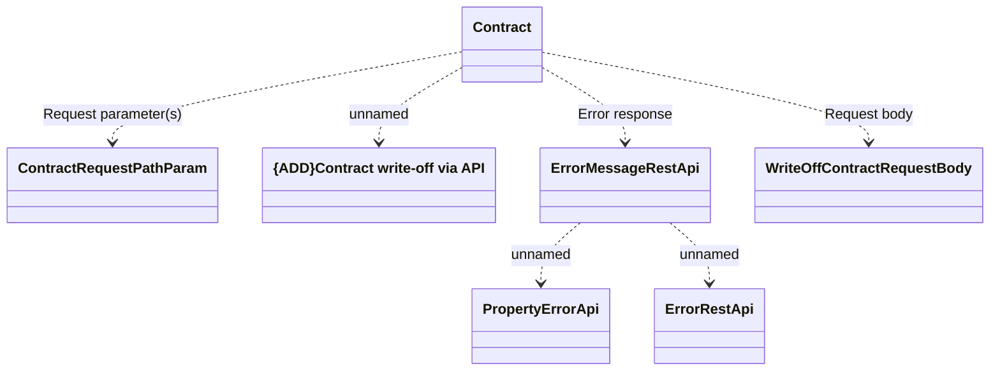

# writeOffContract

- **Diagram Type**: Logical
- **Package**: HomerSelect/BSL/Modules/Contract Management (COMA)/Interface Provided/REST/Application Interface Model/Contracts/v12/writeOffContract
- **Diagram ID**: 160396
- **Elements**: 7
- **Connectors**: 6

