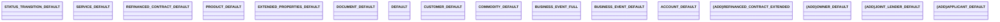

# Projections

```mermaid
classDiagram
    class STATUS_TRANSITION_DEFAULT["STATUS_TRANSITION_DEFAULT"]
    class SERVICE_DEFAULT["SERVICE_DEFAULT"]
    class REFINANCED_CONTRACT_DEFAULT["REFINANCED_CONTRACT_DEFAULT"]
    class PRODUCT_DEFAULT["PRODUCT_DEFAULT"]
    class EXTENDED_PROPERTIES_DEFAULT["EXTENDED_PROPERTIES_DEFAULT"]
    class DOCUMENT_DEFAULT["DOCUMENT_DEFAULT"]
    class DEFAULT["DEFAULT"]
    class CUSTOMER_DEFAULT["CUSTOMER_DEFAULT"]
    class COMMODITY_DEFAULT["COMMODITY_DEFAULT"]
    class BUSINESS_EVENT_FULL["BUSINESS_EVENT_FULL"]
    class BUSINESS_EVENT_DEFAULT["BUSINESS_EVENT_DEFAULT"]
    class ACCOUNT_DEFAULT["ACCOUNT_DEFAULT"]
    class ADD_REFINANCED_CONTRACT_EXTENDED["{ADD}REFINANCED_CONTRACT_EXTENDED"]
    class ADD_OWNER_DEFAULT["{ADD}OWNER_DEFAULT"]
    class ADD_JOINT_LENDER_DEFAULT["{ADD}JOINT_LENDER_DEFAULT"]
    class ADD_APPLICANT_DEFAULT["{ADD}APPLICANT_DEFAULT"]
```
