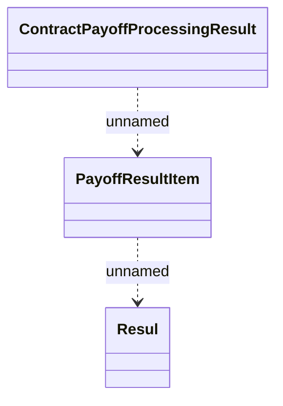

# ContractPayoffProcessingResult

- **Diagram Type**: Logical
- **Package**: HomerSelect/BSL/Modules/Contract Management (COMA)/Interface Provided/Rabbit/v1.0/ContractPayoffProcessingResult
- **Diagram ID**: 162521
- **Elements**: 3
- **Connectors**: 2

