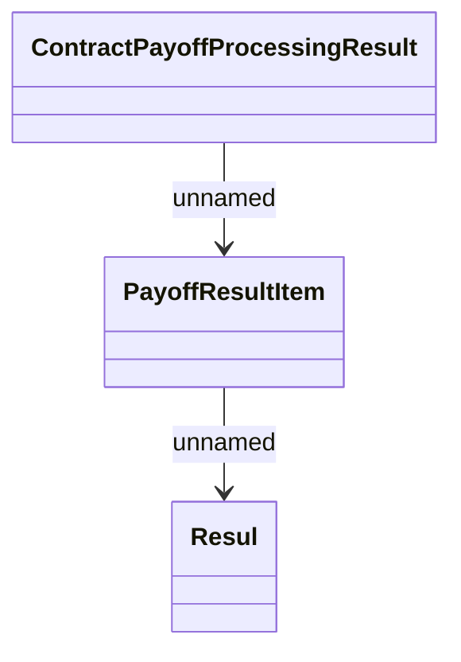

# ContractPayoffProcessingResult

```mermaid
classDiagram
    class Resul["Resul"]
    class ContractPayoffProcessingResult["ContractPayoffProcessingResult"]
    class PayoffResultItem["PayoffResultItem"]
    ContractPayoffProcessingResult --> PayoffResultItem : unnamed
    PayoffResultItem --> Resul : unnamed
```
