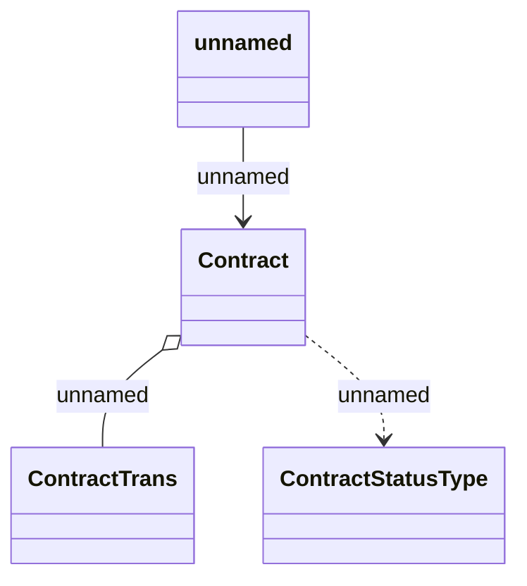

# Job parameters

- **Diagram Type**: Logical
- **Package**: HomerSelect/BSL/Modules/Contract Management (COMA_NG)/Analytical Model/Contract Operations/Archive Contract/Logical Data Model
- **Diagram ID**: 160186
- **Elements**: 4
- **Connectors**: 3

