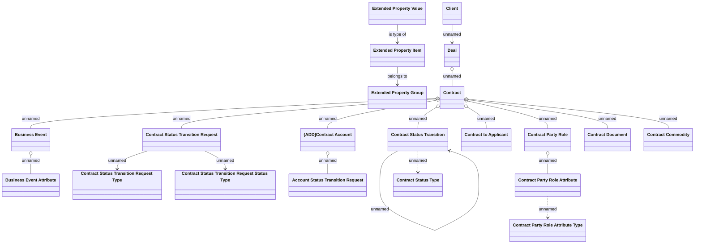

# Logical Data Model

- **Diagram Type**: Logical
- **Package**: HomerSelect/BSL/Modules/Contract Management (COMA_NG)/Analytical Model/Contract Operations/COMMON for COMA_NG/Logical Data Model
- **Diagram ID**: 163936
- **Elements**: 21
- **Connectors**: 20

