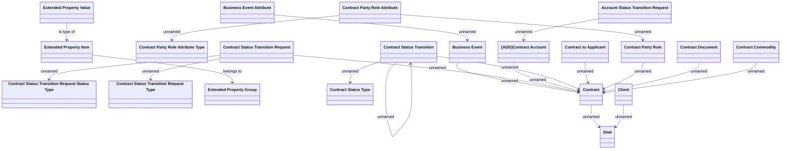

# Logical Data Model

```mermaid
classDiagram
    class Account_Status_Transition_Request["Account Status Transition Request"]
    class Contract_Status_Transition_Request_Status_Type["Contract Status Transition Request Status Type"]
    class Contract_Status_Transition_Request_Type["Contract Status Transition Request Type"]
    class ADD_Contract_Account["{ADD]Contract Account"]
    class Contract_Party_Role_Attribute_Type["Contract Party Role Attribute Type"]
    class Contract_Party_Role_Attribute["Contract Party Role Attribute"]
    class Business_Event_Attribute["Business Event Attribute"]
    class Extended_Property_Value["Extended Property Value"]
    class Extended_Property_Item["Extended Property Item"]
    class Extended_Property_Group["Extended Property Group"]
    class Contract_Status_Transition["Contract Status Transition"]
    class Contract_Status_Type["Contract Status Type"]
    class Contract_Status_Transition_Request["Contract Status Transition Request"]
    class Client["Client"]
    class Contract_to_Applicant["Contract to Applicant"]
    class Deal["Deal"]
    class Contract_Party_Role["Contract Party Role"]
    class Contract_Document["Contract Document"]
    class Contract_Commodity["Contract Commodity"]
    class Business_Event["Business Event"]
    class Contract["Contract"]
    Contract_Party_Role_Attribute --> Contract_Party_Role : unnamed
    Contract_Status_Transition_Request --> Contract_Status_Transition_Request_Type : unnamed
    Account_Status_Transition_Request --> ADD_Contract_Account : unnamed
    Contract_Party_Role_Attribute --> Contract_Party_Role_Attribute_Type : unnamed
    Extended_Property_Value --> Extended_Property_Item : is type of
    Extended_Property_Item --> Extended_Property_Group : belongs to
    Contract_Status_Transition --> Contract_Status_Transition : unnamed
    Contract_Status_Transition --> Contract_Status_Type : unnamed
    Contract_Status_Transition_Request --> Contract_Status_Transition_Request_Status_Type : unnamed
    Contract --> Deal : unnamed
    Business_Event --> Contract : unnamed
    Business_Event_Attribute --> Business_Event : unnamed
    Contract_Status_Transition_Request --> Contract : unnamed
    ADD_Contract_Account --> Contract : unnamed
    Contract_Status_Transition --> Contract : unnamed
    Contract_to_Applicant --> Contract : unnamed
    Contract_Party_Role --> Contract : unnamed
    Contract_Document --> Contract : unnamed
    Contract_Commodity --> Contract : unnamed
    Client --> Deal : unnamed
```
