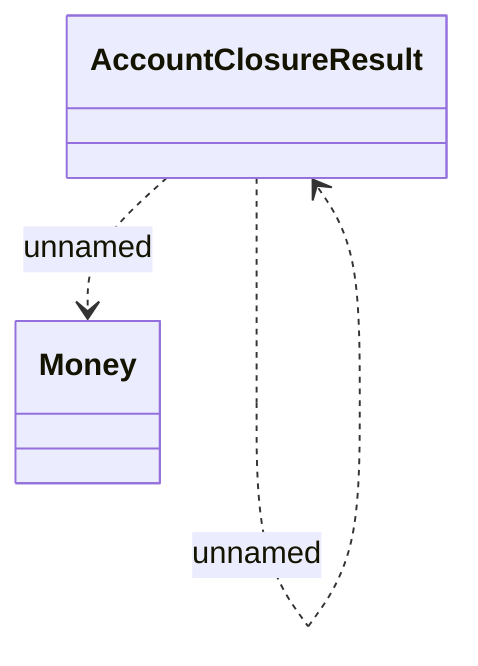

# ProcessAccountClosureResult

- **Diagram Type**: Logical
- **Package**: HomerSelect/BSL/Modules/Contract Management (COMA_NG)/Interface Consumed/RabbitMQ/Account Management/v2.0/ProcessAccountClosureResult
- **Diagram ID**: 160201
- **Elements**: 3
- **Connectors**: 2

