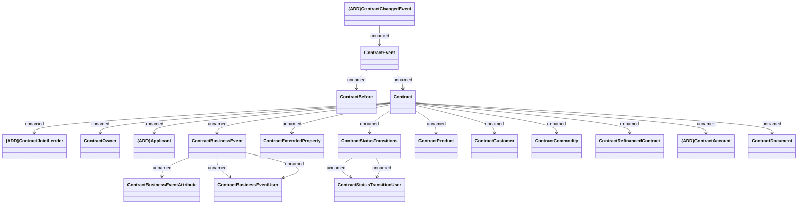

# ContractChangedEvent

```mermaid
classDiagram
    class ADD_ContractJointLender["{ADD}ContractJointLender"]
    class ContractOwner["ContractOwner"]
    class ADD_Applicant["{ADD}Applicant"]
    class ContractStatusTransitionUser["ContractStatusTransitionUser"]
    class ContractBusinessEventUser["ContractBusinessEventUser"]
    class ContractBusinessEventAttribute["ContractBusinessEventAttribute"]
    class ContractBusinessEvent["ContractBusinessEvent"]
    class ContractExtendedProperty["ContractExtendedProperty"]
    class ContractStatusTransitions["ContractStatusTransitions"]
    class ContractProduct["ContractProduct"]
    class ContractCustomer["ContractCustomer"]
    class ContractCommodity["ContractCommodity"]
    class ContractRefinancedContract["ContractRefinancedContract"]
    class ADD_ContractAccount["{ADD}ContractAccount"]
    class ContractDocument["ContractDocument"]
    class ContractBefore["ContractBefore"]
    class Contract["Contract"]
    class ContractEvent["ContractEvent"]
    class ADD_ContractChangedEvent["{ADD}ContractChangedEvent"]
    Contract --> ContractProduct : unnamed
    Contract --> ADD_Applicant : unnamed
    Contract --> ContractBusinessEvent : unnamed
    Contract --> ContractExtendedProperty : unnamed
    Contract --> ContractOwner : unnamed
    Contract --> ADD_ContractJointLender : unnamed
    Contract --> ContractCustomer : unnamed
    Contract --> ContractCommodity : unnamed
    Contract --> ContractRefinancedContract : unnamed
    Contract --> ADD_ContractAccount : unnamed
    Contract --> ContractDocument : unnamed
    ContractEvent --> ContractBefore : unnamed
    ContractEvent --> Contract : unnamed
    ADD_ContractChangedEvent --> ContractEvent : unnamed
    Contract --> ContractStatusTransitions : unnamed
    ContractBusinessEvent --> ContractBusinessEventAttribute : unnamed
    ContractStatusTransitions --> ContractStatusTransitionUser : unnamed
    ContractStatusTransitions --> ContractStatusTransitionUser : unnamed
    ContractBusinessEvent --> ContractBusinessEventUser : unnamed
    ContractBusinessEvent --> ContractBusinessEventUser : unnamed
```
