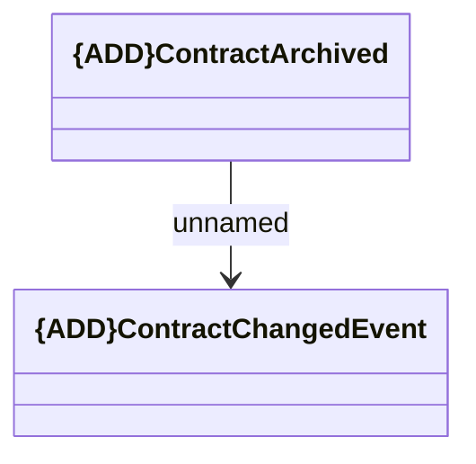

# ContractArchived

```mermaid
classDiagram
    class ADD_ContractChangedEvent["{ADD}ContractChangedEvent"]
    class ADD_ContractArchived["{ADD}ContractArchived"]
    ADD_ContractArchived --> ADD_ContractChangedEvent : unnamed
```
