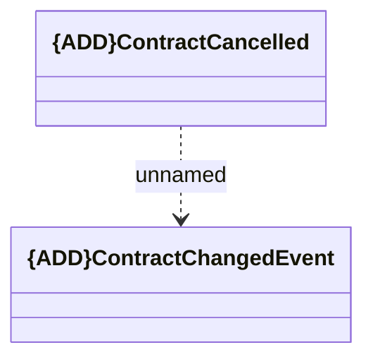

# {ADD}ContractCancelled

- **Diagram Type**: Logical
- **Package**: HomerSelect/BSL/Modules/Contract Management (COMA_NG)/Interface Provided/Kafka/Events/v1/ContractCancelled
- **Diagram ID**: 160192
- **Elements**: 2
- **Connectors**: 1

