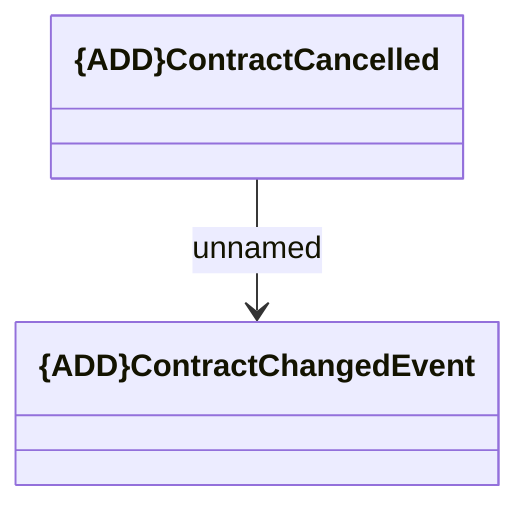

# {ADD}ContractCancelled

```mermaid
classDiagram
    class ADD_ContractChangedEvent["{ADD}ContractChangedEvent"]
    class ADD_ContractCancelled["{ADD}ContractCancelled"]
    ADD_ContractCancelled --> ADD_ContractChangedEvent : unnamed
```
