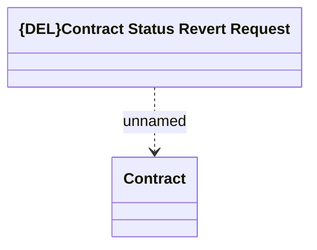

# Contract Status Revert Request

- **Diagram Type**: Logical
- **Package**: HomerSelect/BSL/Modules/Contract Management (COMA_NG)/Interface Provided/Kafka/Requests/v1/Contract Status Revert Request
- **Diagram ID**: 160219
- **Elements**: 2
- **Connectors**: 1

