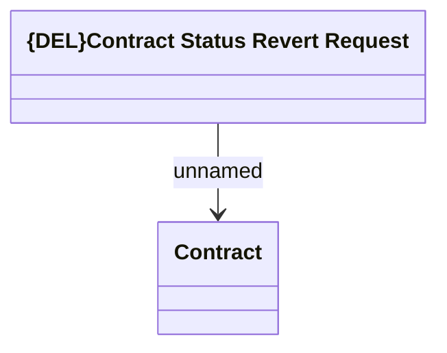

# Contract Status Revert Request

```mermaid
classDiagram
    class Contract["Contract"]
    class DEL_Contract_Status_Revert_Request["{DEL}Contract Status Revert Request"]
    DEL_Contract_Status_Revert_Request --> Contract : unnamed
```
