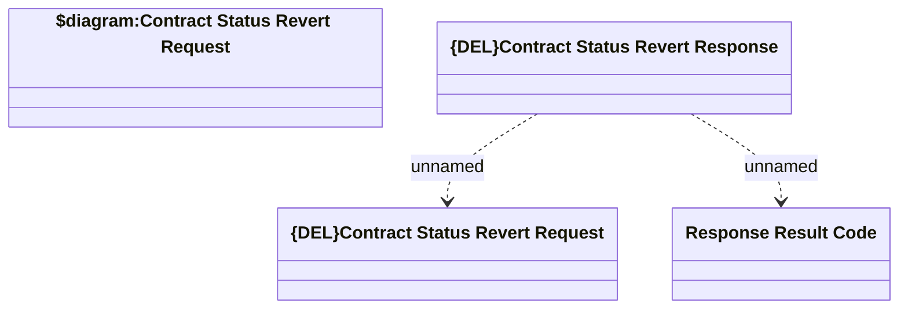

# Contract Status Revert Response

- **Diagram Type**: Logical
- **Package**: HomerSelect/BSL/Modules/Contract Management (COMA_NG)/Interface Provided/Kafka/Responses/v1/Contract Status Revert Response
- **Diagram ID**: 160220
- **Elements**: 4
- **Connectors**: 2

