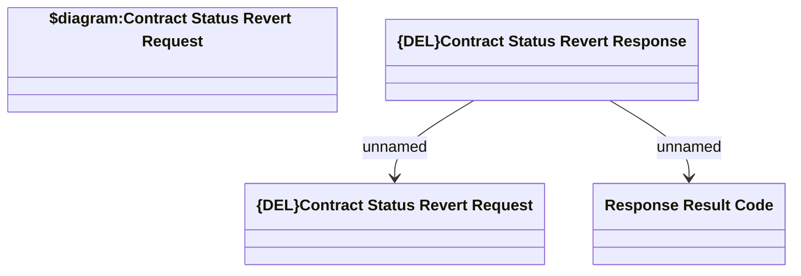

# Contract Status Revert Response

```mermaid
classDiagram
    class diagram_Contract_Status_Revert_Request["$diagram:Contract Status Revert Request"]
    class Response_Result_Code["Response Result Code"]
    class DEL_Contract_Status_Revert_Response["{DEL}Contract Status Revert Response"]
    class DEL_Contract_Status_Revert_Request["{DEL}Contract Status Revert Request"]
    DEL_Contract_Status_Revert_Response --> DEL_Contract_Status_Revert_Request : unnamed
    DEL_Contract_Status_Revert_Response --> Response_Result_Code : unnamed
```
