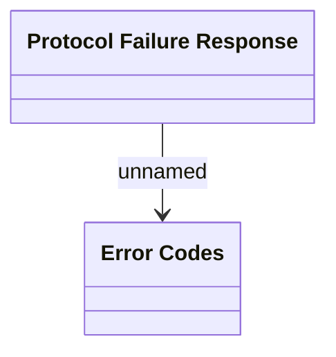

# Protocol Failure Response

```mermaid
classDiagram
    class Error_Codes["Error Codes"]
    class Protocol_Failure_Response["Protocol Failure Response"]
    Protocol_Failure_Response --> Error_Codes : unnamed
```
