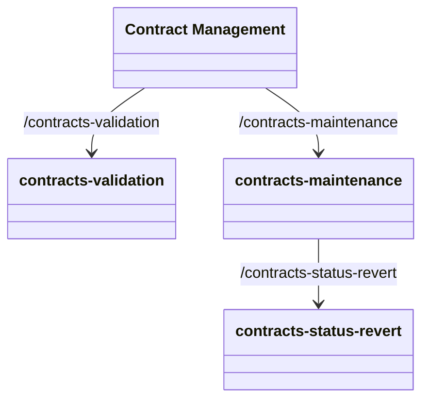

# REST

```mermaid
classDiagram
    class contracts_validation["contracts-validation"]
    class contracts_status_revert["contracts-status-revert"]
    class contracts_maintenance["contracts-maintenance"]
    class Contract_Management["Contract Management"]
    Contract_Management --> contracts_validation : /contracts-validation
    Contract_Management --> contracts_maintenance : /contracts-maintenance
    contracts_maintenance --> contracts_status_revert : /contracts-status-revert
```
