# Assign Credit Account

- **Diagram Type**: Logical
- **Package**: HomerSelect/BSL/Modules/Contract Management (COMA_NG)/Interface Provided/REST/Application Interface Model/Contracts Operations/{MOD}v1/{ADD}AssignCreditAccount
- **Diagram ID**: 162823
- **Elements**: 4
- **Connectors**: 15

```mermaid
classDiagram
    class AssignCreditAccountRequest["AssignCreditAccountRequest"]
    class ContractRequestPathParam["ContractRequestPathParam"]
    class MOD_Assign_Credit_Account_to_Contract["{MOD}Assign Credit Account to Contract"]
    class Contracts["Contracts"]
    Contracts ..> ContractRequestPathParam : Request path param(s)
    Contracts ..> ContractRequestPathParam : Request path parameter(s)
    Contracts ..> ContractRequestPathParam : Request path parameter(s)
    Contracts ..> AssignCreditAccountRequest : unnamed
    Contracts ..> ContractRequestPathParam : Request path parameter(s)
    Contracts ..> ContractRequestPathParam : Request path parameter(s)
    Contracts ..> ContractRequestPathParam : Request path parameter(s)
    Contracts ..> MOD_Assign_Credit_Account_to_Contract : unnamed
    Contracts ..> ContractRequestPathParam : Request path parameter(s)
    Contracts ..> ContractRequestPathParam : Request path parameter(s)
    Contracts ..> ContractRequestPathParam : Request path parameter(s)
    Contracts ..> ContractRequestPathParam : Request path parameter(s)
    Contracts ..> ContractRequestPathParam : Request path parameter(s)
    Contracts ..> ContractRequestPathParam : Request path parameter(s)
    Contracts ..> ContractRequestPathParam : Request path parameter(s)
```

