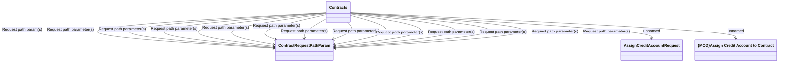

# Assign Credit Account

```mermaid
classDiagram
    class AssignCreditAccountRequest["AssignCreditAccountRequest"]
    class ContractRequestPathParam["ContractRequestPathParam"]
    class MOD_Assign_Credit_Account_to_Contract["{MOD}Assign Credit Account to Contract"]
    class Contracts["Contracts"]
    Contracts --> ContractRequestPathParam : Request path param(s)
    Contracts --> ContractRequestPathParam : Request path parameter(s)
    Contracts --> ContractRequestPathParam : Request path parameter(s)
    Contracts --> AssignCreditAccountRequest : unnamed
    Contracts --> ContractRequestPathParam : Request path parameter(s)
    Contracts --> ContractRequestPathParam : Request path parameter(s)
    Contracts --> ContractRequestPathParam : Request path parameter(s)
    Contracts --> MOD_Assign_Credit_Account_to_Contract : unnamed
    Contracts --> ContractRequestPathParam : Request path parameter(s)
    Contracts --> ContractRequestPathParam : Request path parameter(s)
    Contracts --> ContractRequestPathParam : Request path parameter(s)
    Contracts --> ContractRequestPathParam : Request path parameter(s)
    Contracts --> ContractRequestPathParam : Request path parameter(s)
    Contracts --> ContractRequestPathParam : Request path parameter(s)
    Contracts --> ContractRequestPathParam : Request path parameter(s)
```
