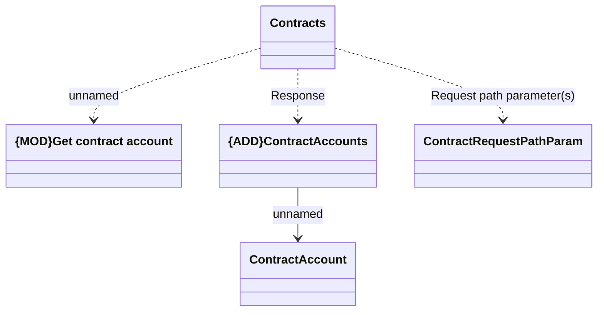

# Get Contract Accounts

- **Diagram Type**: Logical
- **Package**: HomerSelect/BSL/Modules/Contract Management (COMA_NG)/Interface Provided/REST/Application Interface Model/Contracts Operations/{MOD}v1/getContractAccount
- **Diagram ID**: 163987
- **Elements**: 5
- **Connectors**: 4

