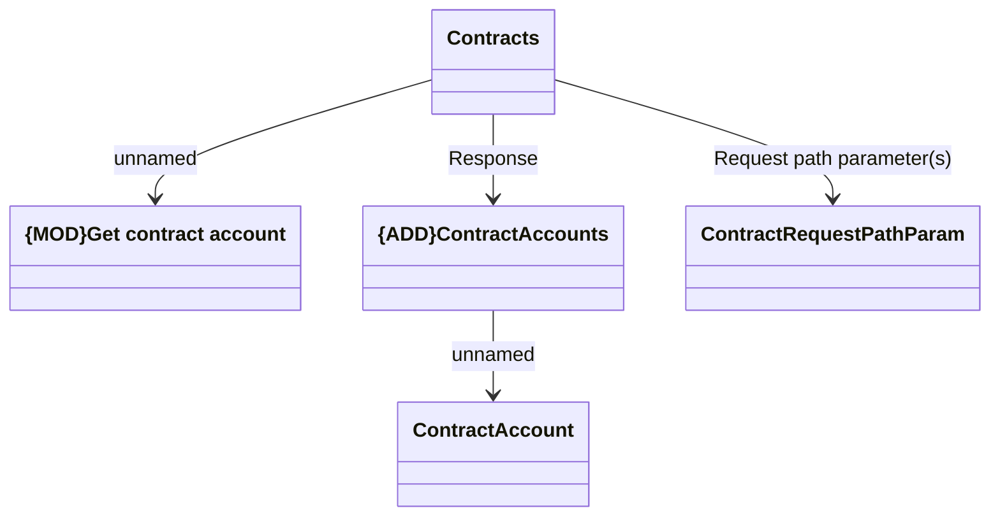

# Get Contract Accounts

```mermaid
classDiagram
    class MOD_Get_contract_account["{MOD}Get contract account"]
    class ADD_ContractAccounts["{ADD}ContractAccounts"]
    class ContractRequestPathParam["ContractRequestPathParam"]
    class ContractAccount["ContractAccount"]
    class Contracts["Contracts"]
    Contracts --> ADD_ContractAccounts : Response
    Contracts --> ContractRequestPathParam : Request path parameter(s)
    Contracts --> MOD_Get_contract_account : unnamed
    ADD_ContractAccounts --> ContractAccount : unnamed
```
