# createBusinessEvent

- **Diagram Type**: Logical
- **Package**: HomerSelect/BSL/Modules/Contract Management (COMA_NG)/Interface Provided/REST/Application Interface Model/Contracts Operations/{MOD}v1/createBusinessEvent
- **Diagram ID**: 162312
- **Elements**: 8
- **Connectors**: 18

```mermaid
classDiagram
    class ContractRequestPathParam["ContractRequestPathParam"]
    class BusinessEventRequestBody["BusinessEventRequestBody"]
    class Contracts["Contracts"]
    class Create_contract_business_event["Create contract business event"]
    class CreateContractBusinessEventAttribute["CreateContractBusinessEventAttribute"]
    class ContractBusinessEventAttribute["ContractBusinessEventAttribute"]
    class ContractBusinessEventUser["ContractBusinessEventUser"]
    class ContractBusinessEvent["ContractBusinessEvent"]
    Contracts ..> ContractRequestPathParam : Request path parameter(s)
    BusinessEventRequestBody ..> CreateContractBusinessEventAttribute : unnamed
    Contracts ..> ContractRequestPathParam : Request path param(s)
    Contracts ..> ContractRequestPathParam : Request path parameter(s)
    Contracts ..> ContractRequestPathParam : Request path parameter(s)
    Contracts ..> ContractRequestPathParam : Request path parameter(s)
    Contracts ..> ContractRequestPathParam : Request path parameter(s)
    Contracts ..> ContractRequestPathParam : Request path parameter(s)
    Contracts ..> ContractRequestPathParam : Request path parameter(s)
    Contracts ..> ContractRequestPathParam : Request path parameter(s)
    Contracts ..> ContractRequestPathParam : Request path parameter(s)
    Contracts ..> ContractRequestPathParam : Request path parameter(s)
    Contracts ..> ContractBusinessEvent : Response
    Contracts ..> BusinessEventRequestBody : Request Body
    Contracts ..> Create_contract_business_event : unnamed
    ContractBusinessEvent --> ContractBusinessEventUser : unnamed
    ContractBusinessEvent --> ContractBusinessEventUser : unnamed
    ContractBusinessEvent --> ContractBusinessEventAttribute : unnamed
```

