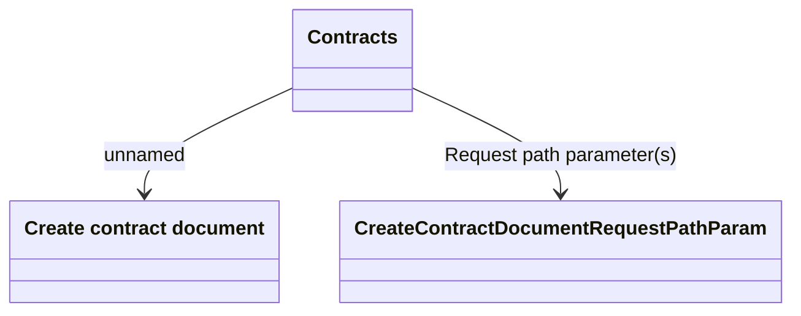

# createContractDocument

```mermaid
classDiagram
    class Contracts["Contracts"]
    class CreateContractDocumentRequestPathParam["CreateContractDocumentRequestPathParam"]
    class Create_contract_document["Create contract document"]
    Contracts --> Create_contract_document : unnamed
    Contracts --> CreateContractDocumentRequestPathParam : Request path parameter(s)
```
