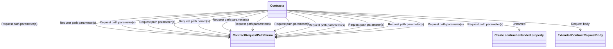

# createContractExtendedProperty

```mermaid
classDiagram
    class ContractRequestPathParam["ContractRequestPathParam"]
    class ExtendedContractRequestBody["ExtendedContractRequestBody"]
    class Contracts["Contracts"]
    class Create_contract_extended_property["Create contract extended property"]
    Contracts --> ContractRequestPathParam : Request path parameter(s)
    Contracts --> ContractRequestPathParam : Request path parameter(s)
    Contracts --> ContractRequestPathParam : Request path parameter(s)
    Contracts --> ContractRequestPathParam : Request path parameter(s)
    Contracts --> ContractRequestPathParam : Request path param(s)
    Contracts --> ContractRequestPathParam : Request path parameter(s)
    Contracts --> ContractRequestPathParam : Request path parameter(s)
    Contracts --> ContractRequestPathParam : Request path parameter(s)
    Contracts --> ContractRequestPathParam : Request path parameter(s)
    Contracts --> ContractRequestPathParam : Request path parameter(s)
    Contracts --> ContractRequestPathParam : Request path parameter(s)
    Contracts --> ContractRequestPathParam : Request path parameter(s)
    Contracts --> ContractRequestPathParam : Request path parameter(s)
    Contracts --> Create_contract_extended_property : unnamed
    Contracts --> ExtendedContractRequestBody : Request body
```
