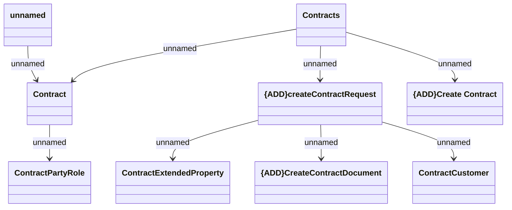

# createContract

```mermaid
classDiagram
    class Contracts["Contracts"]
    class ContractPartyRole["ContractPartyRole"]
    class Contract["Contract"]
    class ContractExtendedProperty["ContractExtendedProperty"]
    class ADD_CreateContractDocument["{ADD}CreateContractDocument"]
    class ContractCustomer["ContractCustomer"]
    class ADD_createContractRequest["{ADD}createContractRequest"]
    class ADD_Create_Contract["{ADD}Create Contract"]
    ADD_createContractRequest --> ContractCustomer : unnamed
    ADD_createContractRequest --> ADD_CreateContractDocument : unnamed
    ADD_createContractRequest --> ContractExtendedProperty : unnamed
    unnamed --> Contract : unnamed
    Contracts --> ADD_Create_Contract : unnamed
    Contracts --> ADD_createContractRequest : unnamed
    Contracts --> Contract : unnamed
    Contract --> ContractPartyRole : unnamed
```
