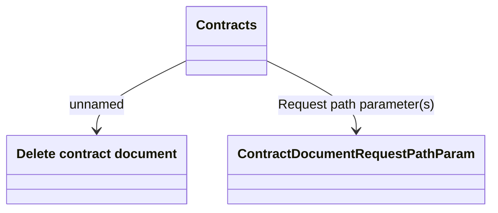

# deleteContractDocument

```mermaid
classDiagram
    class Contracts["Contracts"]
    class ContractDocumentRequestPathParam["ContractDocumentRequestPathParam"]
    class Delete_contract_document["Delete contract document"]
    Contracts --> Delete_contract_document : unnamed
    Contracts --> ContractDocumentRequestPathParam : Request path parameter(s)
```
