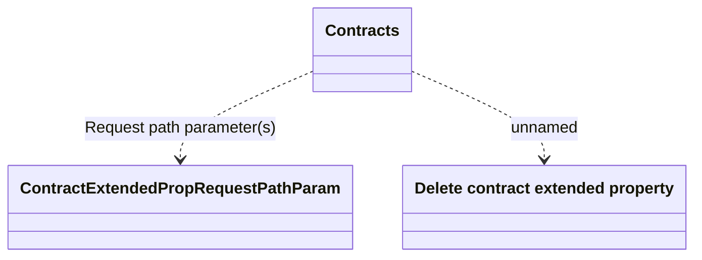

# deleteContractExtendedProperty

- **Diagram Type**: Logical
- **Package**: HomerSelect/BSL/Modules/Contract Management (COMA_NG)/Interface Provided/REST/Application Interface Model/Contracts Operations/{MOD}v1/deleteContractExtendedProperty
- **Diagram ID**: 162314
- **Elements**: 3
- **Connectors**: 2

