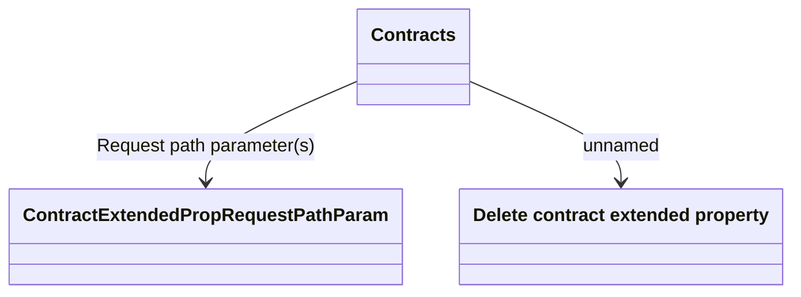

# deleteContractExtendedProperty

```mermaid
classDiagram
    class Contracts["Contracts"]
    class ContractExtendedPropRequestPathParam["ContractExtendedPropRequestPathParam"]
    class Delete_contract_extended_property["Delete contract extended property"]
    Contracts --> ContractExtendedPropRequestPathParam : Request path parameter(s)
    Contracts --> Delete_contract_extended_property : unnamed
```
