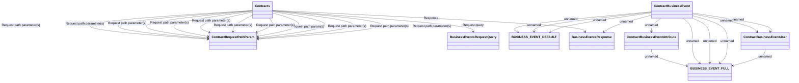

# getBusinessEvents

```mermaid
classDiagram
    class ContractRequestPathParam["ContractRequestPathParam"]
    class BusinessEventsRequestQuery["BusinessEventsRequestQuery"]
    class Contracts["Contracts"]
    class BUSINESS_EVENT_FULL["BUSINESS_EVENT_FULL"]
    class BUSINESS_EVENT_DEFAULT["BUSINESS_EVENT_DEFAULT"]
    class BusinessEventsResponse["BusinessEventsResponse"]
    class ContractBusinessEventAttribute["ContractBusinessEventAttribute"]
    class ContractBusinessEventUser["ContractBusinessEventUser"]
    class ContractBusinessEvent["ContractBusinessEvent"]
    ContractBusinessEvent --> BusinessEventsResponse : unnamed
    Contracts --> ContractRequestPathParam : Request path parameter(s)
    Contracts --> ContractRequestPathParam : Request path parameter(s)
    Contracts --> ContractRequestPathParam : Request path parameter(s)
    Contracts --> ContractRequestPathParam : Request path param(s)
    Contracts --> ContractRequestPathParam : Request path parameter(s)
    Contracts --> ContractRequestPathParam : Request path parameter(s)
    Contracts --> ContractRequestPathParam : Request path parameter(s)
    Contracts --> ContractRequestPathParam : Request path parameter(s)
    Contracts --> ContractRequestPathParam : Request path parameter(s)
    Contracts --> ContractRequestPathParam : Request path parameter(s)
    Contracts --> ContractRequestPathParam : Request path parameter(s)
    Contracts --> BusinessEventsResponse : Response
    Contracts --> BusinessEventsRequestQuery : Request query
    ContractBusinessEventUser --> BUSINESS_EVENT_FULL : unnamed
    ContractBusinessEvent --> ContractBusinessEventUser : unnamed
    ContractBusinessEvent --> ContractBusinessEventUser : unnamed
    ContractBusinessEvent --> BUSINESS_EVENT_DEFAULT : unnamed
    ContractBusinessEvent --> BUSINESS_EVENT_DEFAULT : unnamed
    ContractBusinessEvent --> BUSINESS_EVENT_FULL : unnamed
    ContractBusinessEvent --> ContractBusinessEventAttribute : unnamed
    ContractBusinessEvent --> BUSINESS_EVENT_FULL : unnamed
    ContractBusinessEvent --> BUSINESS_EVENT_FULL : unnamed
    ContractBusinessEvent --> BUSINESS_EVENT_DEFAULT : unnamed
    ContractBusinessEventAttribute --> BUSINESS_EVENT_FULL : unnamed
```
