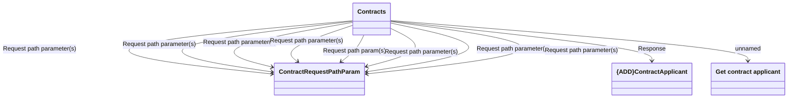

# getContractApplicant

```mermaid
classDiagram
    class ContractRequestPathParam["ContractRequestPathParam"]
    class Contracts["Contracts"]
    class ADD_ContractApplicant["{ADD}ContractApplicant"]
    class Get_contract_applicant["Get contract applicant"]
    Contracts --> ContractRequestPathParam : Request path parameter(s)
    Contracts --> ContractRequestPathParam : Request path parameter(s)
    Contracts --> ContractRequestPathParam : Request path parameter(s)
    Contracts --> ContractRequestPathParam : Request path parameter(s)
    Contracts --> ContractRequestPathParam : Request path param(s)
    Contracts --> ContractRequestPathParam : Request path parameter(s)
    Contracts --> ContractRequestPathParam : Request path parameter(s)
    Contracts --> ContractRequestPathParam : Request path parameter(s)
    Contracts --> ADD_ContractApplicant : Response
    Contracts --> Get_contract_applicant : unnamed
```
