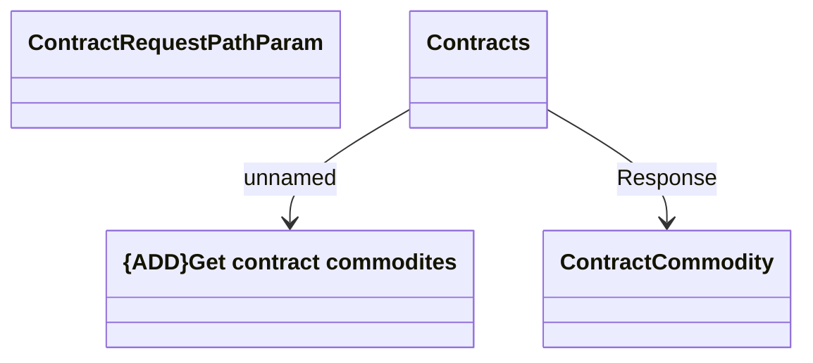

# getContractCommodities

```mermaid
classDiagram
    class ContractRequestPathParam["ContractRequestPathParam"]
    class Contracts["Contracts"]
    class ADD_Get_contract_commodites["{ADD}Get contract commodites"]
    class ContractCommodity["ContractCommodity"]
    Contracts --> ADD_Get_contract_commodites : unnamed
    Contracts --> ContractCommodity : Response
```
