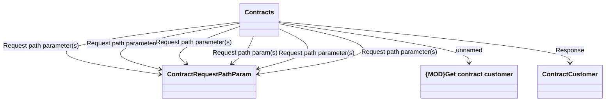

# getContractCustomer

```mermaid
classDiagram
    class ContractRequestPathParam["ContractRequestPathParam"]
    class Contracts["Contracts"]
    class ContractCustomer["ContractCustomer"]
    class MOD_Get_contract_customer["{MOD}Get contract customer"]
    Contracts --> ContractRequestPathParam : Request path parameter(s)
    Contracts --> ContractRequestPathParam : Request path parameter(s)
    Contracts --> ContractRequestPathParam : Request path parameter(s)
    Contracts --> ContractRequestPathParam : Request path param(s)
    Contracts --> ContractRequestPathParam : Request path parameter(s)
    Contracts --> ContractRequestPathParam : Request path parameter(s)
    Contracts --> MOD_Get_contract_customer : unnamed
    Contracts --> ContractCustomer : Response
```
