# getContractDocuments

- **Diagram Type**: Logical
- **Package**: HomerSelect/BSL/Modules/Contract Management (COMA_NG)/Interface Provided/REST/Application Interface Model/Contracts Operations/{MOD}v1/getContractDocuments
- **Diagram ID**: 163268
- **Elements**: 4
- **Connectors**: 15

```mermaid
classDiagram
    class ContractRequestPathParam["ContractRequestPathParam"]
    class ContractDocument["ContractDocument"]
    class Contracts["Contracts"]
    class Get_contract_documents["Get contract documents"]
    Contracts ..> ContractRequestPathParam : Request path param(s)
    Contracts ..> ContractRequestPathParam : Request path parameter(s)
    Contracts ..> ContractRequestPathParam : Request path parameter(s)
    Contracts ..> Get_contract_documents : unnamed
    Contracts ..> ContractDocument : Response
    Contracts ..> ContractRequestPathParam : Request path parameter(s)
    Contracts ..> ContractRequestPathParam : Request path parameter(s)
    Contracts ..> ContractRequestPathParam : Request path parameter(s)
    Contracts ..> ContractRequestPathParam : Request path parameter(s)
    Contracts ..> ContractRequestPathParam : Request path parameter(s)
    Contracts ..> ContractRequestPathParam : Request path parameter(s)
    Contracts ..> ContractRequestPathParam : Request path parameter(s)
    Contracts ..> ContractRequestPathParam : Request path parameter(s)
    Contracts ..> ContractRequestPathParam : Request path parameter(s)
    Contracts ..> ContractRequestPathParam : Request path parameter(s)
```

