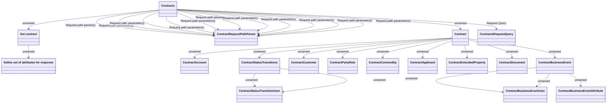

# getContract

```mermaid
classDiagram
    class Define_set_of_attributes_for_response["Define set of attributes for response"]
    class Get_contract["Get contract"]
    class ContractAccount["ContractAccount"]
    class ContractStatusTransitionUser["ContractStatusTransitionUser"]
    class ContractStatusTransitions["ContractStatusTransitions"]
    class ContractCustomer["ContractCustomer"]
    class ContractPartyRole["ContractPartyRole"]
    class ContractCommodity["ContractCommodity"]
    class ContractApplicant["ContractApplicant"]
    class ContractRequestPathParam["ContractRequestPathParam"]
    class ContractExtendedProperty["ContractExtendedProperty"]
    class ContractDocument["ContractDocument"]
    class ContractBusinessEventUser["ContractBusinessEventUser"]
    class ContractBusinessEventAttribute["ContractBusinessEventAttribute"]
    class ContractBusinessEvent["ContractBusinessEvent"]
    class Contract["Contract"]
    class Contracts["Contracts"]
    class ContractsRequestQuery["ContractsRequestQuery"]
    ContractStatusTransitions --> ContractStatusTransitionUser : unnamed
    Contract --> ContractStatusTransitions : unnamed
    Contract --> ContractCustomer : unnamed
    Contract --> ContractPartyRole : unnamed
    Contract --> ContractCommodity : unnamed
    Contract --> ContractApplicant : unnamed
    ContractStatusTransitions --> ContractStatusTransitionUser : unnamed
    ContractBusinessEvent --> ContractBusinessEventUser : unnamed
    Contracts --> Get_contract : unnamed
    Contract --> ContractAccount : unnamed
    Contract --> ContractBusinessEvent : unnamed
    ContractBusinessEvent --> ContractBusinessEventUser : unnamed
    Contract --> ContractDocument : unnamed
    Contract --> ContractExtendedProperty : unnamed
    ContractBusinessEvent --> ContractBusinessEventAttribute : unnamed
    Get_contract --> Define_set_of_attributes_for_response : unnamed
    Contracts --> ContractRequestPathParam : Request path param(s)
    Contracts --> ContractRequestPathParam : Request path parameter(s)
    Contracts --> ContractRequestPathParam : Request path parameter(s)
    Contracts --> ContractRequestPathParam : Request path parameter(s)
    Contracts --> ContractRequestPathParam : Request path parameter(s)
    Contracts --> ContractRequestPathParam : Request path parameter(s)
    Contracts --> ContractsRequestQuery : Request Query
    Contracts --> ContractRequestPathParam : Request path parameter(s)
    Contracts --> ContractRequestPathParam : Request path parameter(s)
    Contracts --> Contract : unnamed
    Contracts --> ContractRequestPathParam : Request path parameter(s)
    Contracts --> ContractRequestPathParam : Request path parameter(s)
    Contracts --> ContractRequestPathParam : Request path parameter(s)
```
