# getExtendedProperties

- **Diagram Type**: Logical
- **Package**: HomerSelect/BSL/Modules/Contract Management (COMA_NG)/Interface Provided/REST/Application Interface Model/Contracts Operations/{MOD}v1/getExtendedProperties
- **Diagram ID**: 162318
- **Elements**: 4
- **Connectors**: 12

```mermaid
classDiagram
    class ContractRequestPathParam["ContractRequestPathParam"]
    class Get_contract_extended_properties["Get contract extended properties"]
    class Contracts["Contracts"]
    class ContractExtendedProperty["ContractExtendedProperty"]
    Contracts ..> ContractRequestPathParam : Request path parameter(s)
    Contracts ..> ContractRequestPathParam : Request path param(s)
    Contracts ..> ContractRequestPathParam : Request path parameter(s)
    Contracts ..> ContractRequestPathParam : Request path parameter(s)
    Contracts ..> ContractRequestPathParam : Request path parameter(s)
    Contracts ..> ContractRequestPathParam : Request path parameter(s)
    Contracts ..> ContractRequestPathParam : Request path parameter(s)
    Contracts ..> ContractRequestPathParam : Request path parameter(s)
    Contracts ..> ContractRequestPathParam : Request path parameter(s)
    Contracts ..> ContractRequestPathParam : Request path parameter(s)
    Contracts ..> Get_contract_extended_properties : unnamed
    Contracts ..> ContractExtendedProperty : Response
```

