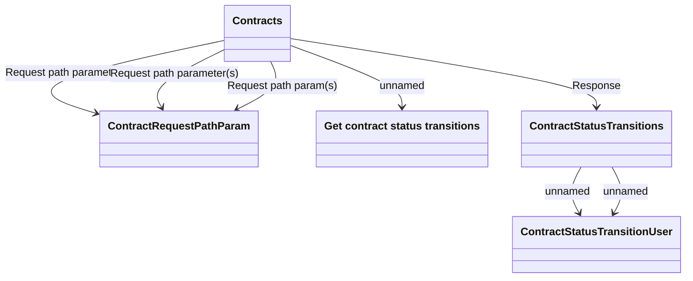

# getStatusTransitions

```mermaid
classDiagram
    class ContractRequestPathParam["ContractRequestPathParam"]
    class Get_contract_status_transitions["Get contract status transitions"]
    class Contracts["Contracts"]
    class ContractStatusTransitionUser["ContractStatusTransitionUser"]
    class ContractStatusTransitions["ContractStatusTransitions"]
    Contracts --> ContractRequestPathParam : Request path parameter(s)
    Contracts --> ContractRequestPathParam : Request path parameter(s)
    Contracts --> ContractRequestPathParam : Request path param(s)
    Contracts --> Get_contract_status_transitions : unnamed
    Contracts --> ContractStatusTransitions : Response
    ContractStatusTransitions --> ContractStatusTransitionUser : unnamed
    ContractStatusTransitions --> ContractStatusTransitionUser : unnamed
```
