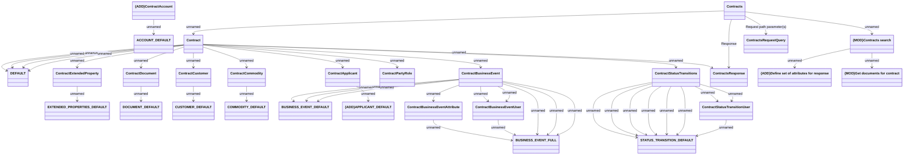

# searchContracts

```mermaid
classDiagram
    class STATUS_TRANSITION_DEFAULT["STATUS_TRANSITION_DEFAULT"]
    class EXTENDED_PROPERTIES_DEFAULT["EXTENDED_PROPERTIES_DEFAULT"]
    class DOCUMENT_DEFAULT["DOCUMENT_DEFAULT"]
    class CUSTOMER_DEFAULT["CUSTOMER_DEFAULT"]
    class COMMODITY_DEFAULT["COMMODITY_DEFAULT"]
    class BUSINESS_EVENT_FULL["BUSINESS_EVENT_FULL"]
    class BUSINESS_EVENT_DEFAULT["BUSINESS_EVENT_DEFAULT"]
    class ACCOUNT_DEFAULT["ACCOUNT_DEFAULT"]
    class ADD_APPLICANT_DEFAULT["{ADD}APPLICANT_DEFAULT"]
    class DEFAULT["DEFAULT"]
    class ContractStatusTransitionUser["ContractStatusTransitionUser"]
    class ContractStatusTransitions["ContractStatusTransitions"]
    class ContractExtendedProperty["ContractExtendedProperty"]
    class ContractDocument["ContractDocument"]
    class ContractCustomer["ContractCustomer"]
    class ContractBusinessEventUser["ContractBusinessEventUser"]
    class ContractBusinessEventAttribute["ContractBusinessEventAttribute"]
    class ContractBusinessEvent["ContractBusinessEvent"]
    class ContractPartyRole["ContractPartyRole"]
    class ContractCommodity["ContractCommodity"]
    class ContractApplicant["ContractApplicant"]
    class ADD_ContractAccount["{ADD}ContractAccount"]
    class Contract["Contract"]
    class Contracts["Contracts"]
    class MOD_Contracts_search["{MOD}Contracts search"]
    class ContractsRequestQuery["ContractsRequestQuery"]
    class ContractsResponse["ContractsResponse"]
    class ADD_Define_set_of_attributes_for_response["{ADD}Define set of attributes for response"]
    class MOD_Get_documents_for_contract["{MOD}Get documents for contract"]
    Contract --> ContractsResponse : unnamed
    Contracts --> ContractsResponse : Response
    Contracts --> MOD_Contracts_search : unnamed
    Contracts --> ContractsRequestQuery : Request path parameter(s)
    Contracts --> Contract : unnamed
    MOD_Contracts_search --> MOD_Get_documents_for_contract : unnamed
    MOD_Contracts_search --> ADD_Define_set_of_attributes_for_response : unnamed
    ContractBusinessEventAttribute --> BUSINESS_EVENT_FULL : unnamed
    ContractBusinessEvent --> ContractBusinessEventAttribute : unnamed
    Contract --> ContractPartyRole : unnamed
    ContractStatusTransitions --> STATUS_TRANSITION_DEFAULT : unnamed
    ContractStatusTransitions --> ContractStatusTransitionUser : unnamed
    ContractStatusTransitions --> STATUS_TRANSITION_DEFAULT : unnamed
    ContractStatusTransitions --> STATUS_TRANSITION_DEFAULT : unnamed
    ContractStatusTransitions --> STATUS_TRANSITION_DEFAULT : unnamed
    ContractStatusTransitions --> ContractStatusTransitionUser : unnamed
    Contract --> ContractStatusTransitions : unnamed
    ContractStatusTransitions --> STATUS_TRANSITION_DEFAULT : unnamed
    ContractStatusTransitions --> STATUS_TRANSITION_DEFAULT : unnamed
    Contract --> ContractDocument : unnamed
    ContractDocument --> DOCUMENT_DEFAULT : unnamed
    ADD_ContractAccount --> ACCOUNT_DEFAULT : unnamed
    Contract --> DEFAULT : unnamed
    Contract --> DEFAULT : unnamed
    Contract --> ContractCustomer : unnamed
    Contract --> DEFAULT : unnamed
    Contract --> DEFAULT : unnamed
    Contract --> ContractBusinessEvent : unnamed
    Contract --> ContractApplicant : unnamed
    Contract --> ContractCommodity : unnamed
    Contract --> ContractExtendedProperty : unnamed
    ContractBusinessEventUser --> BUSINESS_EVENT_FULL : unnamed
    ContractBusinessEvent --> ContractBusinessEventUser : unnamed
    ContractBusinessEvent --> ContractBusinessEventUser : unnamed
    ContractCommodity --> COMMODITY_DEFAULT : unnamed
    ContractExtendedProperty --> EXTENDED_PROPERTIES_DEFAULT : unnamed
    ContractStatusTransitionUser --> STATUS_TRANSITION_DEFAULT : unnamed
    ContractCustomer --> CUSTOMER_DEFAULT : unnamed
    ContractBusinessEvent --> BUSINESS_EVENT_DEFAULT : unnamed
    ContractBusinessEvent --> BUSINESS_EVENT_FULL : unnamed
    ContractBusinessEvent --> BUSINESS_EVENT_FULL : unnamed
    ContractBusinessEvent --> BUSINESS_EVENT_FULL : unnamed
    ContractBusinessEvent --> BUSINESS_EVENT_DEFAULT : unnamed
    ContractBusinessEvent --> BUSINESS_EVENT_DEFAULT : unnamed
    ContractApplicant --> ADD_APPLICANT_DEFAULT : unnamed
```
