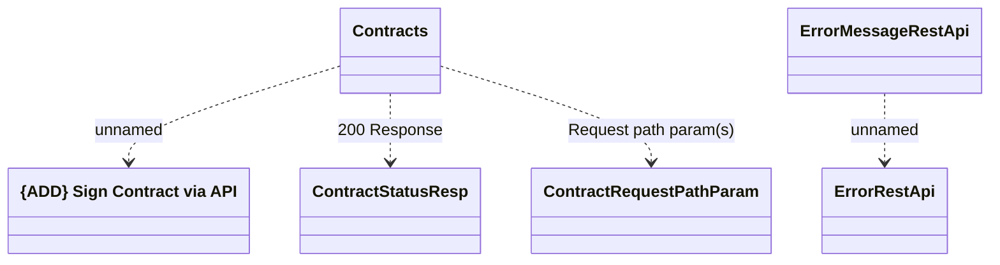

# signContract

- **Diagram Type**: Logical
- **Package**: HomerSelect/BSL/Modules/Contract Management (COMA_NG)/Interface Provided/REST/Application Interface Model/Contracts Operations/{MOD}v1/signContract
- **Diagram ID**: 160760
- **Elements**: 6
- **Connectors**: 4

