# updateContractExtendedProperty

- **Diagram Type**: Logical
- **Package**: HomerSelect/BSL/Modules/Contract Management (COMA_NG)/Interface Provided/REST/Application Interface Model/Contracts Operations/{MOD}v1/updateContractExtendedProperty
- **Diagram ID**: 162320
- **Elements**: 4
- **Connectors**: 13

```mermaid
classDiagram
    class ContractRequestPathParam["ContractRequestPathParam"]
    class ExtendedContractRequestBody["ExtendedContractRequestBody"]
    class Contracts["Contracts"]
    class Update_contract_extended_property["Update contract extended property"]
    Contracts ..> ContractRequestPathParam : Request path parameter(s)
    Contracts ..> ContractRequestPathParam : Request path parameter(s)
    Contracts ..> ContractRequestPathParam : Request path parameter(s)
    Contracts ..> ContractRequestPathParam : Request path param(s)
    Contracts ..> ContractRequestPathParam : Request path parameter(s)
    Contracts ..> ContractRequestPathParam : Request path parameter(s)
    Contracts ..> ContractRequestPathParam : Request path parameter(s)
    Contracts ..> ContractRequestPathParam : Request path parameter(s)
    Contracts ..> ContractRequestPathParam : Request path parameter(s)
    Contracts ..> ContractRequestPathParam : Request path parameter(s)
    Contracts ..> ContractRequestPathParam : Request path parameter(s)
    Contracts ..> Update_contract_extended_property : unnamed
    Contracts ..> ExtendedContractRequestBody : Request body
```

