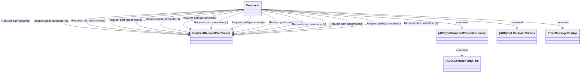

# {ADD}getContractParties

```mermaid
classDiagram
    class ContractRequestPathParam["ContractRequestPathParam"]
    class Contracts["Contracts"]
    class ADD_GetContractPartiesResponse["{ADD}GetContractPartiesResponse"]
    class ADD_Get_Contract_Parties["{ADD}Get Contract Parties"]
    class ErrorMessageRestApi["ErrorMessageRestApi"]
    class ADD_ContractPartyRole["{ADD}ContractPartyRole"]
    ADD_GetContractPartiesResponse --> ADD_ContractPartyRole : unnamed
    Contracts --> ContractRequestPathParam : Request path param(s)
    Contracts --> ContractRequestPathParam : Request path parameter(s)
    Contracts --> ContractRequestPathParam : Request path parameter(s)
    Contracts --> ADD_Get_Contract_Parties : unnamed
    Contracts --> ContractRequestPathParam : Request path parameter(s)
    Contracts --> ContractRequestPathParam : Request path parameter(s)
    Contracts --> ContractRequestPathParam : Request path parameter(s)
    Contracts --> ADD_GetContractPartiesResponse : unnamed
    Contracts --> ContractRequestPathParam : Request path parameter(s)
    Contracts --> ContractRequestPathParam : Request path parameter(s)
    Contracts --> ContractRequestPathParam : Request path parameter(s)
    Contracts --> ErrorMessageRestApi : unnamed
    Contracts --> ContractRequestPathParam : Request path parameter(s)
    Contracts --> ContractRequestPathParam : Request path parameter(s)
    Contracts --> ContractRequestPathParam : Request path parameter(s)
    Contracts --> ContractRequestPathParam : Request path parameter(s)
```
