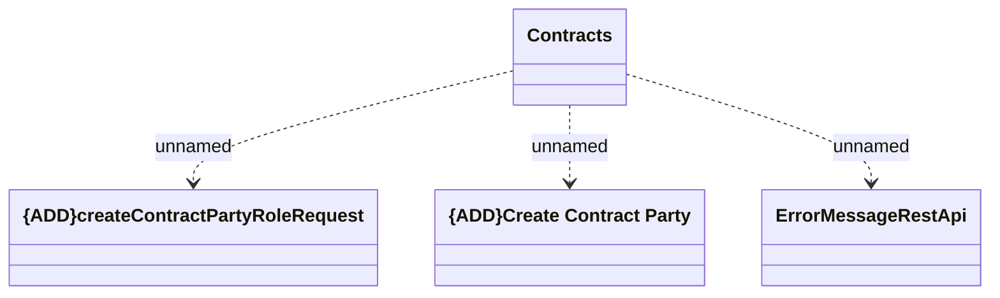

# {ADD}setContractParty

- **Diagram Type**: Logical
- **Package**: HomerSelect/BSL/Modules/Contract Management (COMA_NG)/Interface Provided/REST/Application Interface Model/Contracts Operations/{MOD}v1/{ADD}setContractParty
- **Diagram ID**: 162327
- **Elements**: 4
- **Connectors**: 3

