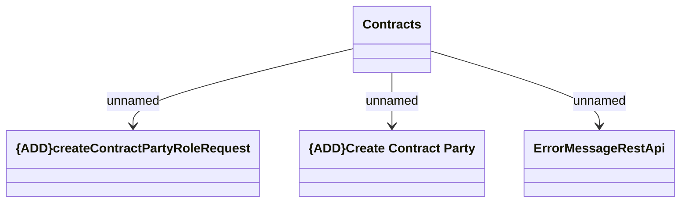

# {ADD}setContractParty

```mermaid
classDiagram
    class Contracts["Contracts"]
    class ErrorMessageRestApi["ErrorMessageRestApi"]
    class ADD_createContractPartyRoleRequest["{ADD}createContractPartyRoleRequest"]
    class ADD_Create_Contract_Party["{ADD}Create Contract Party"]
    Contracts --> ADD_createContractPartyRoleRequest : unnamed
    Contracts --> ADD_Create_Contract_Party : unnamed
    Contracts --> ErrorMessageRestApi : unnamed
```
