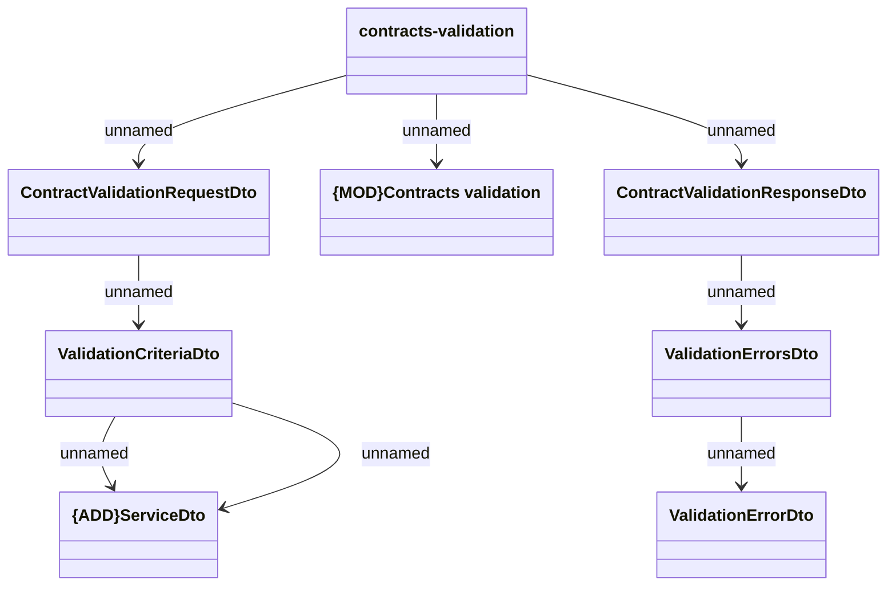

# Contracts validation

```mermaid
classDiagram
    class ADD_ServiceDto["{ADD}ServiceDto"]
    class ValidationErrorsDto["ValidationErrorsDto"]
    class ValidationErrorDto["ValidationErrorDto"]
    class ContractValidationResponseDto["ContractValidationResponseDto"]
    class ValidationCriteriaDto["ValidationCriteriaDto"]
    class MOD_Contracts_validation["{MOD}Contracts validation"]
    class contracts_validation["contracts-validation"]
    class ContractValidationRequestDto["ContractValidationRequestDto"]
    ValidationErrorsDto --> ValidationErrorDto : unnamed
    ContractValidationResponseDto --> ValidationErrorsDto : unnamed
    ValidationCriteriaDto --> ADD_ServiceDto : unnamed
    ValidationCriteriaDto --> ADD_ServiceDto : unnamed
    contracts_validation --> ContractValidationRequestDto : unnamed
    contracts_validation --> MOD_Contracts_validation : unnamed
    ContractValidationRequestDto --> ValidationCriteriaDto : unnamed
    contracts_validation --> ContractValidationResponseDto : unnamed
```
