# Projections

- **Diagram Type**: Logical
- **Package**: HomerSelect/BSL/Modules/Contract Management (COMA_NG)/Interface Provided/REST/Application Interface Model/Projections
- **Diagram ID**: 162306
- **Elements**: 10
- **Connectors**: 0

```mermaid
classDiagram
    class STATUS_TRANSITION_DEFAULT["STATUS_TRANSITION_DEFAULT"]
    class EXTENDED_PROPERTIES_DEFAULT["EXTENDED_PROPERTIES_DEFAULT"]
    class DOCUMENT_DEFAULT["DOCUMENT_DEFAULT"]
    class DEFAULT["DEFAULT"]
    class CUSTOMER_DEFAULT["CUSTOMER_DEFAULT"]
    class COMMODITY_DEFAULT["COMMODITY_DEFAULT"]
    class BUSINESS_EVENT_FULL["BUSINESS_EVENT_FULL"]
    class BUSINESS_EVENT_DEFAULT["BUSINESS_EVENT_DEFAULT"]
    class ACCOUNT_DEFAULT["ACCOUNT_DEFAULT"]
    class ADD_APPLICANT_DEFAULT["{ADD}APPLICANT_DEFAULT"]
```

