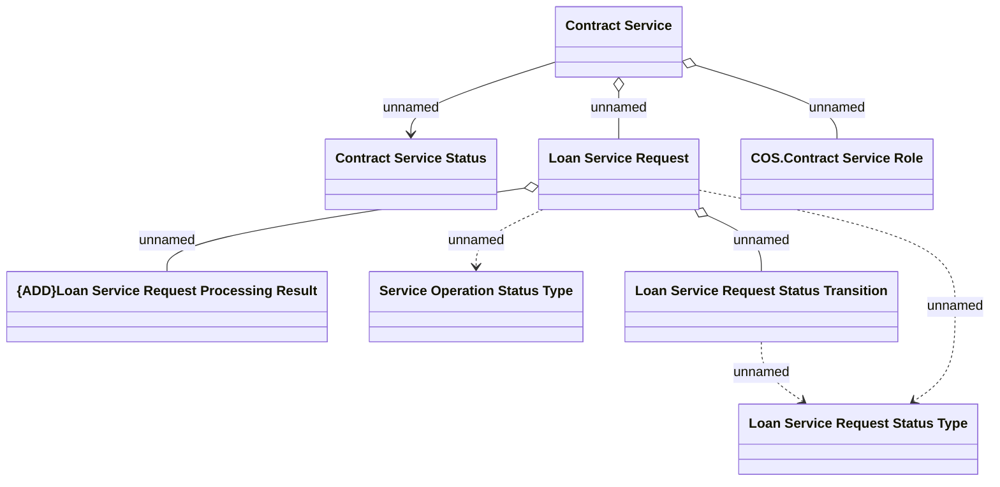

# Logical Data Model

- **Diagram Type**: Logical
- **Package**: HomerSelect/BSL/Modules/Contract Services (COS)/Analytical Model/Logical Data Model
- **Diagram ID**: 161474
- **Elements**: 8
- **Connectors**: 8

